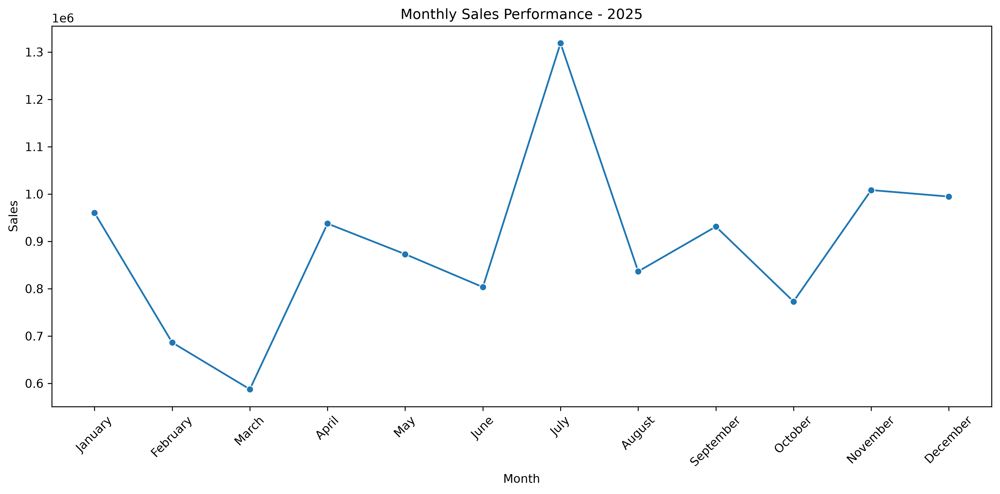
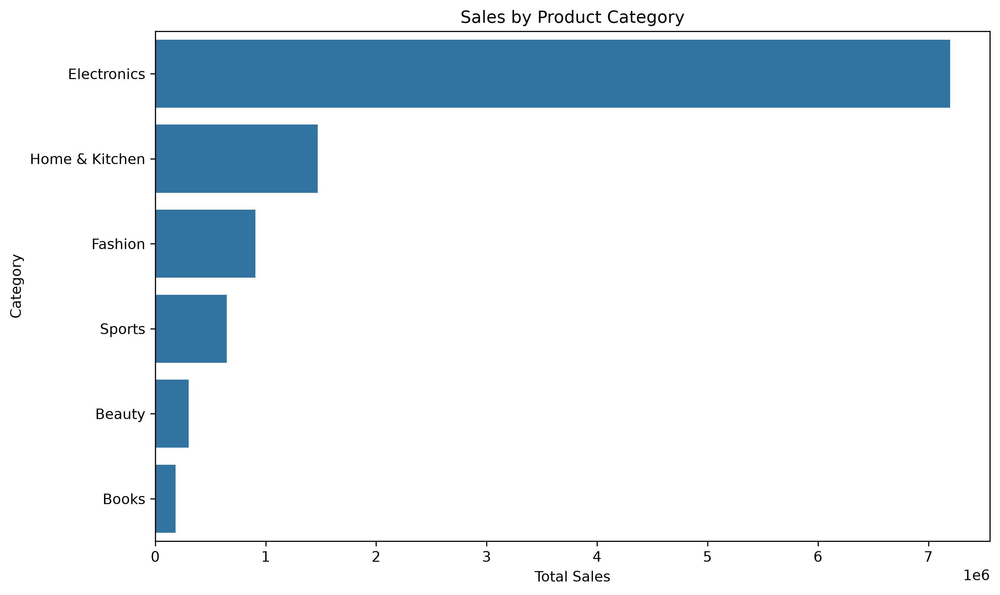
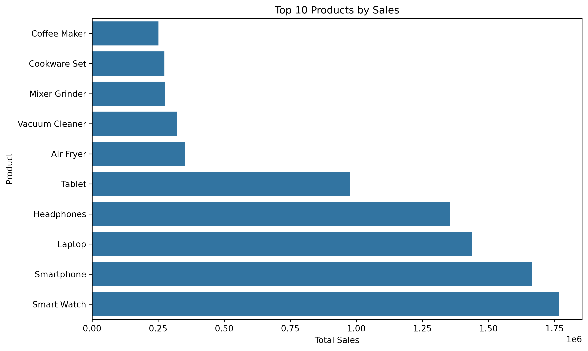
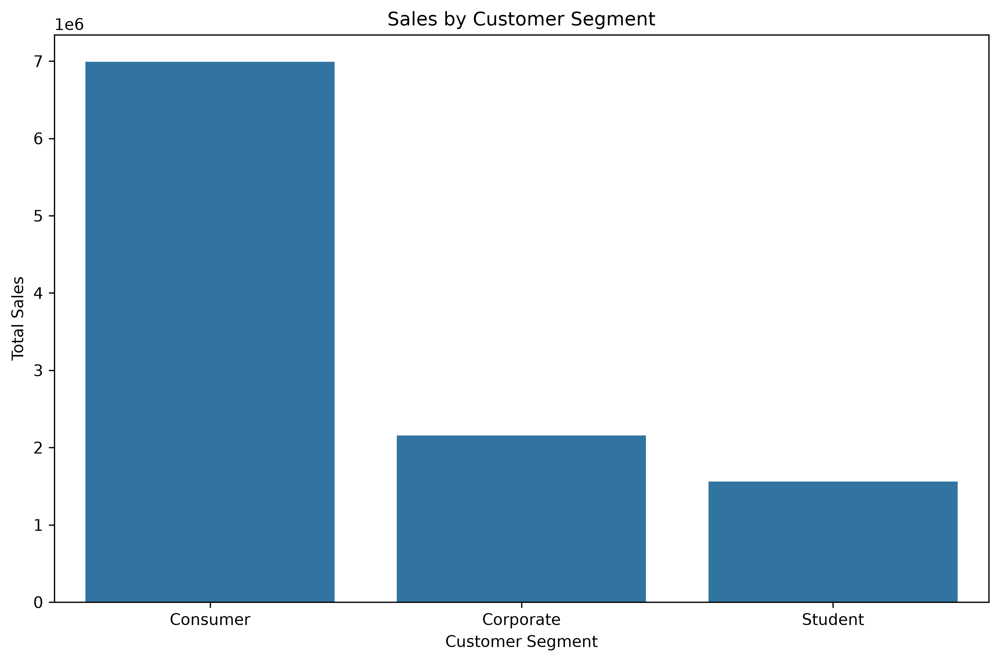
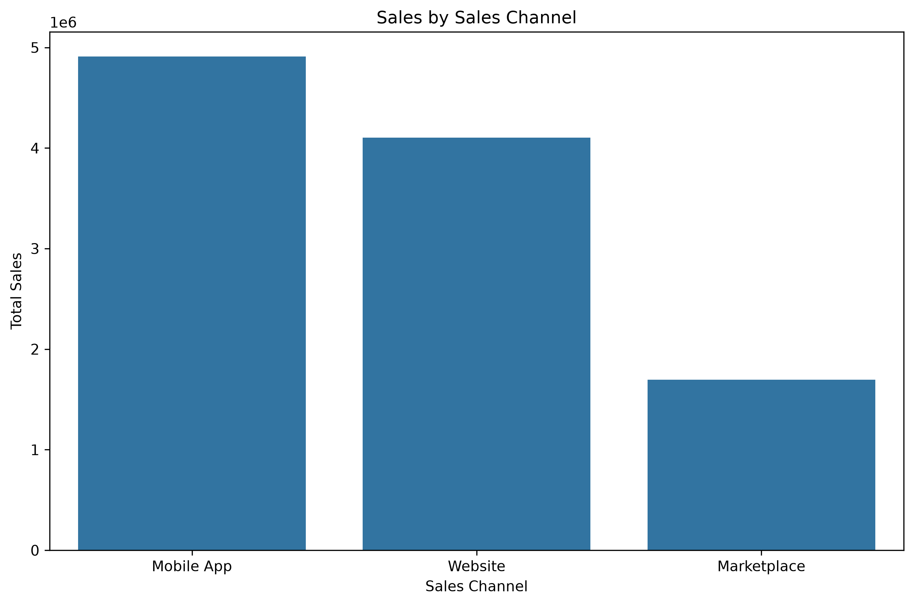
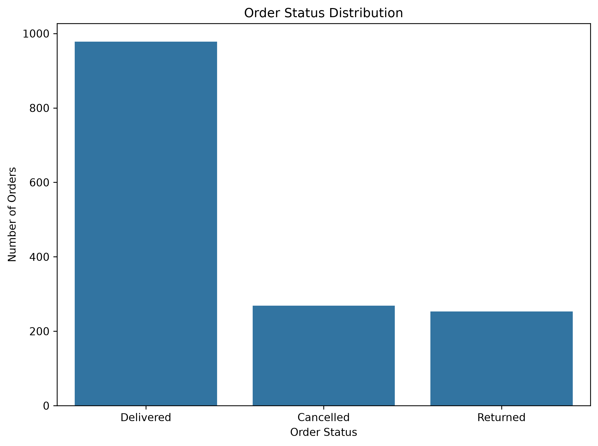
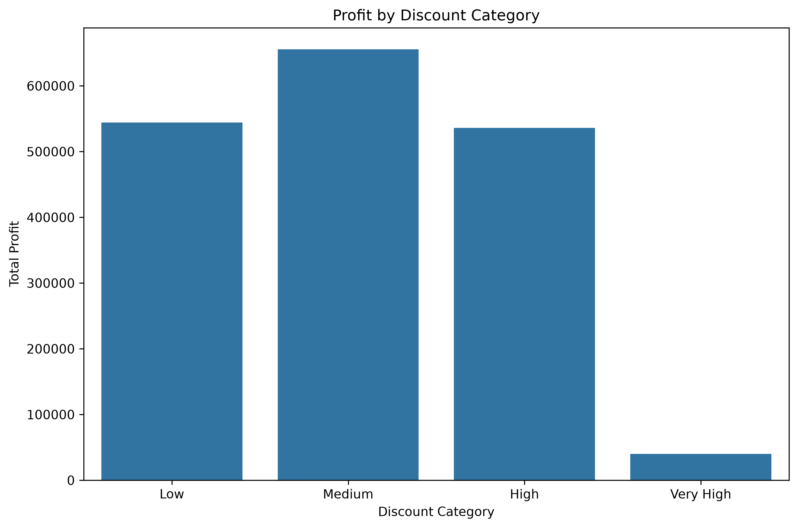
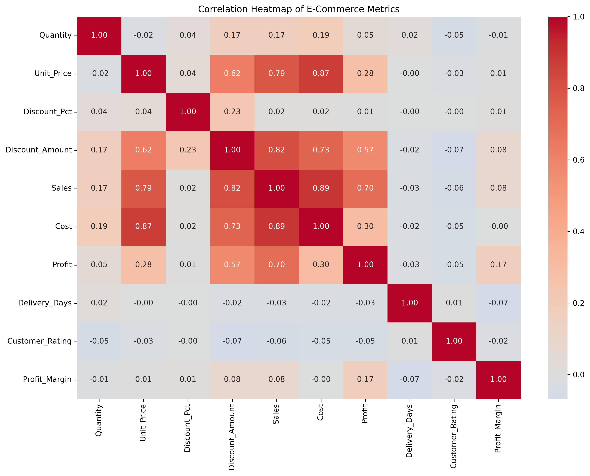

[](https://colab.research.google.com/github/Tripti-code479/E-Commerce-Data-Analysis/blob/main/notebooks/ECommerce_Data_Analysis.ipynb)
# 🛒 E-Commerce Data Analysis Using Python

## 📌 Project Overview

This project analyzes a synthetic e-commerce transaction dataset containing **1,500 orders recorded throughout 2025**.

The objective is to transform raw transaction data into meaningful business insights related to:

- Sales performance
- Profitability
- Product performance
- Category performance
- Customer segments
- Sales channels
- Marketing channels
- Geographic performance
- Order status
- Discounts
- Customer ratings
- Operational performance

The project follows a complete data analytics workflow using Python, from data loading and cleaning to exploratory data analysis, visualization, insights, and business recommendations.

---

## 🎯 Business Objective

The primary objective is to understand the factors driving e-commerce revenue and profitability and identify opportunities for business improvement.

The analysis aims to answer questions such as:

- Which months generate the highest sales and profit?
- Which product categories contribute the most revenue?
- Which products are the strongest performers?
- Which customer segment is most valuable?
- Which sales channel performs best?
- Which marketing channel generates the most sales?
- Which states and cities contribute the most revenue?
- What proportion of orders are returned or cancelled?
- How do discounts affect profitability?
- How do customer ratings relate to business performance?

---

## 🗂️ Dataset

The dataset contains **1,500 synthetic e-commerce transactions** covering:

**January 1, 2025 – December 31, 2025**

The dataset includes information about:

- Order ID
- Order Date
- Customer ID
- Category
- Product
- Quantity
- Unit Price
- Discount Percentage
- Discount Amount
- Sales
- Cost
- Profit
- State
- City
- Customer Segment
- Payment Method
- Sales Channel
- Marketing Channel
- Order Status
- Delivery Days
- Customer Rating

Additional analytical features were created during the project.

---

## 🛠️ Technologies Used

| Technology | Purpose |
|---|---|
| Python | Data analysis |
| Pandas | Data manipulation and analysis |
| NumPy | Numerical calculations |
| Matplotlib | Data visualization |
| Seaborn | Statistical visualization |
| Jupyter Notebook | Analysis and documentation |
| Git & GitHub | Version control and portfolio |

---

## 🔄 Project Workflow

```text
Raw Dataset
     ↓
Data Loading
     ↓
Data Understanding
     ↓
Data Quality Assessment
     ↓
Data Cleaning
     ↓
Feature Engineering
     ↓
Exploratory Data Analysis
     ↓
Data Visualization
     ↓
Business Insights
     ↓
Business Recommendations
```

---

## 🧹 Data Cleaning

The dataset was checked for common data-quality problems, including:

- Missing values
- Duplicate rows
- Duplicate Order IDs
- Invalid quantities
- Invalid unit prices
- Negative sales
- Negative costs
- Invalid delivery days
- Invalid discount percentages
- Invalid discount amounts
- Date validity
- Financial business-rule consistency

### Cleaning Results

| Check | Result |
|---|---:|
| Total Rows | 1,500 |
| Total Columns after Feature Engineering | 28 |
| Missing Values | 0 |
| Duplicate Rows | 0 |
| Duplicate Order IDs | 0 |
| Invalid Quantities | 0 |
| Invalid Unit Prices | 0 |
| Negative Sales | 0 |
| Negative Costs | 0 |
| Invalid Delivery Days | 0 |
| Invalid Discounts | 0 |

The existing Profit field was retained because profit behavior differs by order status, particularly for returned and cancelled orders. The analysis therefore preserves the original business logic rather than replacing Profit with a simplified Sales − Cost calculation.

---

## ⚙️ Feature Engineering

The following analytical features were created:

| Feature | Purpose |
|---|---|
| Year | Annual analysis |
| Month | Monthly trend analysis |
| Month_Name | Readable monthly reporting |
| Quarter | Quarterly analysis |
| Day_Name | Day-of-week analysis |
| Profit_Margin | Profitability measurement |
| Discount_Category | Discount-level comparison |

### Profit Margin

```text
Profit Margin = (Profit / Sales) × 100
```

---

# 📊 Key Performance Indicators

| KPI | Value |
|---|---:|
| 💰 Total Sales | ₹10.71 Million |
| 📈 Total Profit | ₹1.78 Million |
| 🛍️ Total Orders | 1,500 |
| 📦 Quantity Sold | 2,240 |
| 🧾 Average Order Value | ₹7,140 |
| 📊 Overall Profit Margin | 16.58% |
| 🔄 Return Rate | 16.87% |
| ❌ Cancellation Rate | 17.93% |

---

# 🔍 Key Business Insights

### 1. Electronics is the strongest category

Electronics generated approximately **₹7.20 million in sales** and **₹1.16 million in profit**, making it the strongest category by both revenue and profitability.

### 2. July was the strongest month

July generated the highest sales and highest profit during 2025, indicating strong performance during this period.

### 3. Consumers are the most valuable customer segment

The Consumer segment generated approximately **₹6.99 million in sales** and **₹1.06 million in profit** from 971 orders.

### 4. Mobile App is the strongest sales channel

The Mobile App generated approximately **₹4.91 million in sales**, making it the leading sales channel.

### 5. Organic marketing generates the highest sales

Organic marketing generated approximately **₹2.83 million in sales**, the highest among the analyzed marketing channels.

### 6. Festival Sales generate strong profitability

Festival Sales generated approximately **₹4.88 lakh in profit**, showing that promotional campaigns can be highly profitable when managed effectively.

### 7. Rajasthan is the leading state

Rajasthan generated approximately **₹1.31 million in sales**, making it the strongest-performing state in the dataset.

### 8. Udaipur is the leading city

Udaipur generated approximately **₹7.93 lakh in sales**, making it the strongest-performing city.

### 9. Returns and cancellations require attention

The dataset contains:

- 978 delivered orders
- 253 returned orders
- 269 cancelled orders

The return rate is approximately **16.87%**, while the cancellation rate is approximately **17.93%**.

### 10. Medium discounts perform strongly

Medium discounts generated the highest total sales and profit, while very high discounts produced the lowest average profit margin.

### 11. Customer ratings are concentrated around 4 and 5

Rating 4 had the highest number of orders and the highest total sales, followed by rating 5.

### 12. Sales and cost have strong relationships

The correlation analysis showed strong positive relationships between:

- Sales and Cost
- Unit Price and Cost
- Discount Amount and Sales
- Sales and Profit

---

# 📈 Visualizations

The project includes the following visualizations:

### Monthly Sales



### Category Sales



### Top 10 Products



### Customer Segments



### Sales Channels



### Order Status



### Discount vs Profit



### Correlation Heatmap



---

# 💡 Business Recommendations

## 1. Prioritize Electronics

Maintain strong inventory availability for high-performing Electronics products and use targeted promotions to maximize their contribution.

## 2. Focus on High-Performing Products

Products such as Smart Watch, Smartphone, Laptop, and Headphones should receive priority for inventory planning and promotional campaigns.

## 3. Continue Investing in the Mobile App

The Mobile App is the strongest sales channel. Improvements in personalization, recommendations, user experience, and retention could further increase performance.

## 4. Optimize Marketing Spend

Marketing decisions should consider both revenue and profitability. Organic marketing generates strong sales, while Festival Sales demonstrate particularly strong profitability.

## 5. Reduce Cancellations

The cancellation rate of approximately 17.93% should be investigated. Potential causes could include inventory availability, payment issues, processing delays, or customer expectations.

## 6. Monitor Product Returns

The return rate of approximately 16.87% indicates an opportunity to investigate return reasons by product, category, location, and customer segment.

## 7. Avoid Excessive Discounting

Medium discounts produced the strongest combination of sales and profitability in this dataset. Very high discounts should be used selectively.

## 8. Strengthen Consumer Customer Strategies

The Consumer segment is the largest contributor to sales and profit. Loyalty programs, personalized offers, and cross-selling could increase customer value.

## 9. Expand Successful Geographic Markets

High-performing regions such as Rajasthan and Udaipur could be studied to identify similar markets with expansion potential.

## 10. Evaluate Profitability Alongside Revenue

Business decisions should consider sales, profit, margin, returns, cancellations, and customer behavior together rather than focusing only on revenue.

---

# 📁 Project Structure

```text
E-Commerce-Data-Analysis/
│
├── data/
│   ├── ecommerce_sales_analysis_dataset.csv
│   └── ecommerce_sales_analysis_cleaned.csv
│
├── notebooks/
│   └── ECommerce_Data_Analysis.ipynb
│
├── visualizations/
│   ├── monthly_sales.png
│   ├── category_sales.png
│   ├── top_10_products.png
│   ├── customer_segments.png
│   ├── sales_channels.png
│   ├── order_status.png
│   ├── discount_profit.png
│   └── correlation_heatmap.png
│
├── .gitignore
├── requirements.txt
└── README.md
```

---

# 🚀 How to Run the Project

## 1. Clone the repository

```bash
git clone <your-github-repository-url>
```

## 2. Navigate to the project

```bash
cd E-Commerce-Data-Analysis
```

## 3. Create a virtual environment

```bash
python -m venv .venv
```

## 4. Activate the environment

### Windows

```bash
.venv\Scripts\activate
```

### macOS/Linux

```bash
source .venv/bin/activate
```

## 5. Install dependencies

```bash
pip install -r requirements.txt
```

## 6. Launch Jupyter Notebook

```bash
jupyter notebook
```

Open:

```text
notebooks/ECommerce_Data_Analysis.ipynb
```

Run the notebook from top to bottom.

---

# 📌 Project Highlights

This project demonstrates practical Data Analyst skills including:

- Data loading
- Data cleaning
- Data validation
- Feature engineering
- Exploratory Data Analysis
- Aggregation and grouping
- KPI calculation
- Trend analysis
- Product analysis
- Customer segmentation
- Marketing analysis
- Geographic analysis
- Correlation analysis
- Data visualization
- Business insight generation
- Business recommendations
- Python documentation

---

# 👩‍💻 Author

**Tripti Sahu**

Aspiring Data Analyst

### Skills

- Python
- Pandas
- NumPy
- SQL
- Excel
- Power BI
- Data Visualization
- Exploratory Data Analysis

---

## ⭐ If you found this project useful

Feel free to explore the notebook and visualizations to understand the complete analytical workflow.
